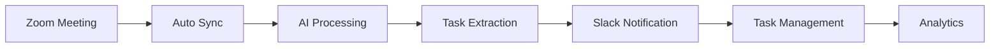

# 🧠 TaskMind macOS

<div align="center">


**AI-Powered Task Management & Meeting Assistant for macOS**

[](https://www.apple.com/macos/)
[](https://electronjs.org/)
[](https://reactjs.org/)
[](https://www.typescriptlang.org/)
[](https://supabase.com/)

[🚀 Quick Start](#-quick-start) • [✨ Features](#-features) • [📖 Documentation](#-documentation) • [🤝 Contributing](#-contributing)

</div>

---

## 📖 Overview

TaskMind is a native macOS desktop application that revolutionizes productivity by automatically extracting actionable tasks from your Zoom meetings using AI. Built with Electron and React, it seamlessly integrates with Zoom, Slack, and OpenAI to create an intelligent task management ecosystem.

### 🎯 What TaskMind Does

- **🤖 AI Task Extraction**: Automatically extracts actionable tasks from meeting transcripts using OpenAI GPT-4o
- **📅 Meeting Sync**: Connects with Zoom to sync meetings and access recordings/transcripts
- **📱 Smart Notifications**: Sends intelligent Slack notifications for task updates and meeting summaries
- **📊 Analytics Dashboard**: Provides comprehensive insights into task completion and meeting productivity
- **⚡ Real-time Sync**: All data syncs in real-time across devices using Supabase

## ✨ Features

### 🧠 **AI-Powered Intelligence**
- **GPT-4o Integration**: Advanced AI for accurate task extraction and meeting summarization
- **Smart Categorization**: Automatically categorizes and prioritizes extracted tasks
- **Context-Aware Processing**: Understands meeting context to generate relevant action items

### 🎥 **Zoom Integration**
- **OAuth Authentication**: Secure connection to your Zoom account
- **Automatic Meeting Sync**: Fetches meetings, recordings, and transcripts automatically
- **Recording Detection**: Identifies meetings with available recordings for processing
- **Transcript Processing**: Processes meeting transcripts for task extraction

### 📱 **Slack Integration**
- **Task Notifications**: Automatic notifications when new tasks are created
- **Meeting Summaries**: AI-generated meeting summaries shared to Slack channels
- **Status Updates**: Real-time notifications for task progress and completion
- **Custom Channels**: Configure notifications for different teams and projects

### 📋 **Task Management**
- **Kanban Board**: Drag-and-drop task management (Todo → In Progress → Done)
- **Priority Levels**: Visual priority indicators and due date management
- **Real-time Updates**: Live synchronization across all devices
- **Progress Tracking**: Comprehensive analytics and completion metrics

### 🔐 **Security & Performance**
- **End-to-End Security**: Secure OAuth flows and encrypted data storage
- **Rate Limiting**: Production-ready API rate limiting and error handling
- **Offline Support**: Works offline with automatic sync when reconnected
- **Auto-Updates**: Seamless application updates via Electron

## 🛠 Tech Stack

<table>
<tr>
<td><strong>Frontend</strong></td>
<td>React 18, TypeScript, Tailwind CSS</td>
</tr>
<tr>
<td><strong>Desktop</strong></td>
<td>Electron, Native macOS Integration</td>
</tr>
<tr>
<td><strong>Backend</strong></td>
<td>Supabase (Database, Auth, Real-time, Edge Functions)</td>
</tr>
<tr>
<td><strong>AI</strong></td>
<td>OpenAI GPT-4o, Custom Prompt Engineering</td>
</tr>
<tr>
<td><strong>Integrations</strong></td>
<td>Zoom API, Slack API, OAuth 2.0</td>
</tr>
<tr>
<td><strong>Development</strong></td>
<td>Webpack, ESLint, Prettier, TypeScript</td>
</tr>
</table>

## 🚀 Quick Start

### Prerequisites

- **macOS** 10.15 or later
- **Node.js** 18+ and npm
- **Accounts**: Supabase, OpenAI API, Zoom Developer, Slack (optional)

### Installation

1. **Clone the repository**
   ```bash
   git clone https://github.com/VatsalPandya47/TaskMindMacos.git
   cd TaskMindMacos
   ```

2. **Install dependencies**
   ```bash
   cd taskmind-desktop
   npm install
   ```

3. **Set up environment variables**
   ```bash
   cp .env.example .env.local
   ```
   
   Edit `.env.local` with your credentials:
   ```env
   # Supabase Configuration
   VITE_SUPABASE_URL=your_supabase_project_url
   VITE_SUPABASE_ANON_KEY=your_supabase_anon_key
   
   # OpenAI Configuration
   VITE_OPENAI_API_KEY=your_openai_api_key
   
   # Zoom Configuration
   ZOOM_CLIENT_ID=your_zoom_client_id
   ZOOM_CLIENT_SECRET=your_zoom_client_secret
   
   # Slack Configuration (Optional)
   SLACK_BOT_TOKEN=your_slack_bot_token
   SLACK_CHANNEL_ID=your_slack_channel_id
   ```

4. **Start the development server**
   ```bash
   npm run dev
   ```

5. **Launch the desktop app**
   ```bash
   npm start
   ```

## 🔧 Setup Guide

### 1. Supabase Setup

1. Create a new project at [supabase.com](https://supabase.com)
2. Get your project URL and anon key from Settings → API
3. Run the database migrations:
   ```bash
   npm run supabase:start
   ```

### 2. OpenAI API Setup

1. Get your API key from [OpenAI Platform](https://platform.openai.com/api-keys)
2. Ensure you have access to GPT-4o model
3. Add the key to your `.env.local` file

### 3. Zoom Integration Setup

1. Create a Zoom App at [Zoom Marketplace](https://marketplace.zoom.us/)
2. Configure OAuth with these scopes:
   - `meeting:read`
   - `recording:read`
   - `user:read`
3. Set redirect URI: `taskmind://zoom-oauth`
4. Add client ID and secret to `.env.local`

### 4. Slack Integration (Optional)

1. Create a Slack App at [api.slack.com](https://api.slack.com)
2. Add bot scopes: `chat:write`, `channels:read`
3. Install app to workspace and get bot token
4. Add token and channel ID to `.env.local`

## 📱 Usage

### Getting Started

1. **Launch TaskMind** and create an account or sign in
2. **Connect Zoom** in the Meetings tab for meeting synchronization
3. **Configure Slack** in Settings for notifications (optional)
4. **Sync Meetings** to fetch your recent Zoom meetings
5. **Extract Tasks** from meetings with recordings using AI

### Workflow



### Key Features Usage

- **📅 Meeting Sync**: Click "Sync Meetings" to fetch latest Zoom meetings
- **🤖 AI Extraction**: Click "Extract & Create Tasks" on recorded meetings
- **📋 Task Management**: Drag tasks between columns (Todo/In Progress/Done)
- **📊 Analytics**: View productivity metrics in the Dashboard tab
- **⚙️ Settings**: Configure integrations and preferences

## 🏗 Architecture

```
TaskMind macOS/
├── 📱 Frontend (React + TypeScript)
│   ├── Authentication System
│   ├── Multi-tab Dashboard
│   ├── Real-time Data Sync
│   └── Native macOS UI
├── 🔧 Services Layer
│   ├── OpenAI Service (GPT-4o)
│   ├── Slack Service
│   ├── Zoom OAuth & API
│   └── Supabase Client
├── 🌐 Backend (Supabase)
│   ├── Edge Functions (6 deployed)
│   ├── PostgreSQL Database
│   ├── Real-time Subscriptions
│   └── Row Level Security
└── 🖥 Desktop (Electron)
    ├── Main Process
    ├── Renderer Process
    └── Native Integration
```

## 📖 Documentation

- [📋 Setup Guide](./taskmind-desktop/SETUP_GUIDE.md)
- [🚀 Deployment Guide](./taskmind-desktop/DEPLOYMENT_COMPLETE.md)
- [🔗 Integration Status](./taskmind-desktop/INTEGRATION_STATUS.md)
- [⚡ Quick Links](./taskmind-desktop/QUICK_LINKS.md)

## 🤝 Contributing

We love contributions! Here's how to get started:

### Development Setup

1. **Fork the repository**
2. **Clone your fork**
   ```bash
   git clone https://github.com/your-username/TaskMindMacos.git
   ```
3. **Create a feature branch**
   ```bash
   git checkout -b feature/amazing-feature
   ```
4. **Make your changes** and test thoroughly
5. **Commit with conventional commits**
   ```bash
   git commit -m "feat: add amazing feature"
   ```
6. **Push and create a Pull Request**

### Guidelines

- Follow TypeScript best practices
- Write tests for new features
- Update documentation as needed
- Ensure all checks pass before submitting

## 📊 Roadmap

- [ ] **Multi-platform Support** (Windows, Linux)
- [ ] **Team Collaboration** features
- [ ] **Advanced Analytics** and reporting
- [ ] **Custom AI Models** for specific industries
- [ ] **Mobile Companion App**
- [ ] **Enterprise Features** (SSO, Admin Panel)

## 📄 License

This project is licensed under the **MIT License** - see the [LICENSE](LICENSE) file for details.

## 🙌 Acknowledgments

- [Electron](https://electronjs.org/) - Desktop application framework
- [React](https://reactjs.org/) - UI library
- [Supabase](https://supabase.com/) - Backend infrastructure
- [OpenAI](https://openai.com/) - AI-powered task extraction
- [Zoom](https://zoom.us/) - Meeting platform integration
- [Slack](https://slack.com/) - Team communication integration

## 📞 Support

- 🐛 [Report Bug](https://github.com/VatsalPandya47/TaskMindMacos/issues)
- 💡 [Request Feature](https://github.com/VatsalPandya47/TaskMindMacos/issues)
- 📧 Contact: [your-email@example.com](mailto:your-email@example.com)

---

<div align="center">

**Built with ❤️ by [Vatsal Pandya](https://github.com/VatsalPandya47)**

⭐ **Star this repo if TaskMind helps boost your productivity!** ⭐

</div> 